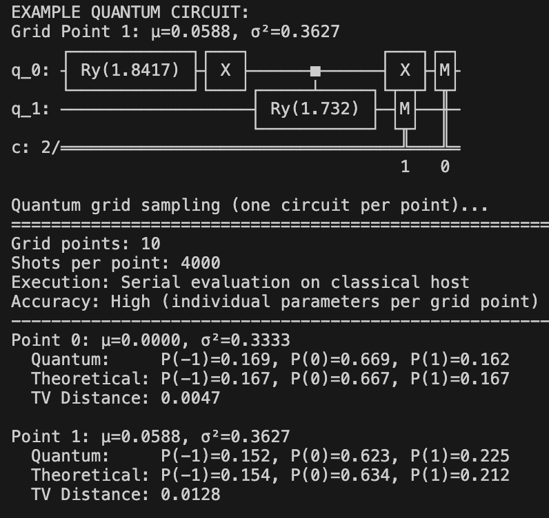

# Quantum Discrete Gaussian Distribution / Maxwell Boltzmann Distribution

The Maxwell-Boltzmann distribution describes the local state of a fluid with a Gaussian distribution in velocity space. The mean of this distribution represents the local velocity of the fluid, and the variance represents the energy (or temperature) of the fluid.


https://en.wikipedia.org/wiki/Maxwell-Boltzmann_distribution 

This module implements quantum computing algorithms for generating discrete Gaussian distributions on 1D and 3D grids with spatially varying parameters.

## What This Does

- **Quantum discrete Gaussian sampling** over velocity outcomes {-1, 0, 1}
- **1D and 3D implementations** with independent dimensions
- **Spatially varying parameters**: Mean velocity and temperature with sine wave modulation
- **Parametric quantum circuits**: Direct encoding of mean and variance into circuit parameters
- **LBM integration**: D3Q27 lattice support with standard moment computation
- **Multiple moment calculation methods**: Direct sampling, theoretical, and LBM-style

## Problem Setup

### 1D Mode

- **Grid**: 10 points in 1D
- **Mean variation**: u(x) = 0.1 * sin(2π * x/10)
- **Variance variation**: T(x) = T0 + 0.05 * sin(2π * x/10), where T0 = 1/3
- **Outcomes**: {-1, 0, 1}

### 3D Mode

- **Grid**: Nx x Ny x Nz points (default: 10 x 6 x 4 = 240 points)
- **Mean velocities**: 
  - μx(x) = 0.1 * sin(2π * x/Nx)
  - μy(y) = 0.1 * sin(2π * y/Ny)
  - μz(z,x) = 0.1 * sin(2π * z/Nz) + 0.02 * sin(2π * x/Nx)
- **Temperature**: T(x) = T0 + 0.05 * sin(2π * x/Nx), where T0 = 1/3
- **Velocity outcomes per dimension**: {-1, 0, 1}
- **Total 3D velocity states**: 27 (D3Q27 lattice)

## Quantum Algorithm

### Parametric Circuit Approach

This implementation uses a novel **parametric quantum circuit** that directly encodes mean velocity and temperature into gate angles, eliminating the need for classical probability computation.

**Key Innovation**: Instead of computing P(-1), P(0), P(+1) classically and then encoding them, we directly compute gate angles from (μ, T):

For 1D:
- Compute p = μ² + T
- Set θ = 2 * arccos(sqrt(p))
- Set φ = 2 * arctan(μ / T) if T > 0

For 3D:
- Apply the same formulas independently to each dimension (x, y, z)
- Use 6 qubits total: 2 qubits per dimension
- Each dimension samples independently from its discrete Gaussian

**Advantages**:
- Direct parameterization: mean and variance encoded directly into circuit
- No classical probability computation required
- Simpler formulas and more numerically stable
- Natural extension to 3D (just repeat for each dimension)

### Qubit Encoding

Uses 2-qubit circuits per dimension to encode discrete Gaussian:

- |00> -> outcome -1
- |01> -> outcome +1
- |10> -> outcome 0
- |11> -> unused



## Implementation Overview

### Core Components

**1D Sampling**:

- `compute_parameters()`: Returns arrays of means and variances for each grid point
- `discrete_gaussian_probs(mu, T)`: Normalized probabilities for {-1, 0, 1}
- `create_quantum_circuit_parametric(mu, T)`: Direct parametric circuit from (μ, T)
- `quantum_sample_grid_point(mu, T, shots)`: Samples one grid point

**3D Sampling**:

- `compute_parameters_3d()`: Returns 3D arrays of (μx, μy, μz, T) for each grid point
- `create_quantum_circuit_3d_parametric(μx, μy, μz, T)`: 6-qubit circuit for 3D velocity
- `quantum_sample_grid_point_3d_parametric(μx, μy, μz, T, shots)`: Samples 3D velocity distribution
- `compute_moments_from_samples_3d(velocity_counts)`: Direct moment calculation from samples
- `compute_theoretical_moments_3d(μx, μy, μz, T)`: Theoretical moments for validation
- `compute_moments_lbm_style(probs_27)`: LBM-style moment computation using standard formulas

**LBM Integration**:

- `get_d3q27_velocity_ordering()`: Returns D3Q27 lattice velocity vectors
- `compute_3d_probability_distribution_lbm_order(μx, μy, μz, T)`: 27-point distribution in LBM order
- `convert_quantum_samples_to_lbm_order(velocity_counts)`: Converts quantum samples to LBM format

### Moment Calculation Methods

Three equivalent methods are provided for computing moments:

1. **Direct from samples**: Sum over quantum measurement outcomes
   - Used during quantum sampling
   - Subject to statistical sampling noise

2. **Theoretical from 1D**: Product of three independent 1D distributions
   - Exact theoretical values
   - Used for validation and comparison

3. **LBM-style**: Standard LBM formulas using D3Q27 velocities
   - ux = sum(f_i * c_ix), Var[vx] = sum(f_i * c_ix^2) - ux^2
   - Compatible with existing LBM codes
   - All three methods produce identical results

### Outputs

- Console summary per grid point with empirical vs theoretical probabilities plus total variation distance
- Plot saved as `results_quantum_sampling.png`

## Usage

### Installation

```bash
# Install dependencies
pip install -r requirements.txt
```

### 1D Sampling

Sample from a 1D discrete Gaussian distribution on a grid:

```bash
# Run 1D quantum simulation with default parameters
python quantum_discrete_gaussian.py
```

This generates a visualization showing mean/variance variations across the grid and probability distributions at each point.

### 3D Single Point Sampling

Sample velocity distribution at a single 3D grid point:

```python
from quantum_discrete_gaussian import QuantumDiscreteGaussian

# Initialize
qdg = QuantumDiscreteGaussian(circuit_type='symmetric')

# Sample at single point with parameters (μx, μy, μz, T)
velocity_counts = qdg.quantum_sample_grid_point_3d_parametric(
    mu_x=0.1,      # Mean x-velocity
    mu_y=-0.05,    # Mean y-velocity  
    mu_z=0.15,     # Mean z-velocity
    T=0.2,         # Temperature
    shots=10000    # Number of quantum samples
)

# Compute moments from samples
moments = qdg.compute_moments_from_samples_3d(velocity_counts)
print(f"Mean velocities: ({moments['mean_x']:.4f}, {moments['mean_y']:.4f}, {moments['mean_z']:.4f})")
print(f"Variances: ({moments['var_x']:.4f}, {moments['var_y']:.4f}, {moments['var_z']:.4f})")
```

### 3D Grid Visualization

Visualize 3D velocity and temperature fields on a full grid:

```bash
# Visualize a 10x6x4 grid with 10000 shots per point, showing z-slice 1
python visualize_3d_fields.py --Nx 10 --Ny 6 --Nz 4 --slice 1 --shots 10000

# Smaller grid for quick testing (5x4x3 = 60 points)
python visualize_3d_fields.py --Nx 5 --Ny 4 --Nz 3 --slice 1 --shots 5000

# Higher accuracy with more shots
python visualize_3d_fields.py --Nx 10 --Ny 6 --Nz 4 --slice 1 --shots 20000

# Save plot without displaying
python visualize_3d_fields.py --Nx 10 --Ny 6 --Nz 4 --slice 1 --shots 10000 --save-only
```

The visualization generates a 4x2 panel plot comparing input parameters (μx, μy, μz, T) with quantum-sampled outputs (E[vx], E[vy], E[vz], average variance).

### LBM Integration

Compute moments using standard LBM formulas (compatible with D3Q27 lattice):

```python
from quantum_discrete_gaussian import QuantumDiscreteGaussian

qdg = QuantumDiscreteGaussian(circuit_type='symmetric')

# Get theoretical 27-point probability distribution in LBM order
probs_27 = qdg.compute_3d_probability_distribution_lbm_order(
    mu_x=0.1, mu_y=-0.05, mu_z=0.15, T=0.2
)

# Compute moments using LBM formulas: ux = sum(f_i * c_ix)
moments_lbm = qdg.compute_moments_lbm_style(probs_27)
print(f"LBM mean velocities: ({moments_lbm['mean_x']:.4f}, {moments_lbm['mean_y']:.4f}, {moments_lbm['mean_z']:.4f})")
print(f"LBM density: {moments_lbm['rho']:.6f}")
```

### Convergence Testing

Test how errors decrease with increasing shot count:

```bash
# Run convergence analysis (tests 1000 to 50000 shots)
python test_convergence.py
```

This generates a convergence plot showing error vs shot count and validates the 1/sqrt(N) scaling law.

## Output

### 1D Mode

The program generates:

1. **Console output**: Parameter values and probability comparisons for each grid point
2. **Visualization**: Four-panel plot showing:
   - Mean parameter variation across the grid
   - Variance parameter variation across the grid
   - 2D heatmap of empirical probability distributions
   - Theoretical vs quantum empirical comparison at each grid point

### 3D Mode

The visualization generates:

1. **Console output**: Statistical analysis including:
   - Mean velocity errors (E[vx], E[vy], E[vz])
   - Variance error
   - Field ranges for input and output
   - Validation results

2. **4x2 Panel Visualization** showing z-slices:
   - Row 1: Input μx vs Quantum E[vx]
   - Row 2: Input μy vs Quantum E[vy]
   - Row 3: Input μz vs Quantum E[vz]
   - Row 4: Input T vs Quantum average variance

### Accuracy

Quantum sampling error scales as 1/sqrt(N) where N is the number of shots:

- 1000 shots: error approximately 0.012
- 5000 shots: error approximately 0.005
- 10000 shots: error approximately 0.003
- 20000 shots: error approximately 0.002

For production use, 15000-20000 shots per point provides excellent accuracy (error < 0.003).


## Algorithm Complexity

**Qubits Required**:

- 1D: 2 qubits per grid point
- 3D: 6 qubits per grid point (2 per dimension)

**Gate Depth**: O(1) per point (constant depth)

**Sampling**: Each grid point sampled independently

**Scaling**:

- Error scales as 1/sqrt(N) where N is number of shots
- Grid points sampled sequentially (classical loop over grid)
- Total time scales linearly with number of grid points

## Theoretical Background

### Discrete Probability Formulation

For discrete Gaussian distribution over {-1, 0, 1}, we use the Maxwell-Boltzmann form from Section 2.2.4 of [Sawant (2024)](https://doi.org/10.3929/ethz-b-000607045):

```text
p = μ² + T
P(-1) = -0.5 * μ + 0.5 * p
P(0) = -p + 1.0
P(+1) = 0.5 * μ + 0.5 * p
```

where μ is the mean velocity and T is the temperature. This formulation ensures:
- Probabilities sum to 1
- Mean of distribution equals μ
- Variance of distribution equals T (temperature)

### Quantum Circuit Implementation

The quantum circuit encodes these probabilities using a hierarchical decomposition with 2 qubits:

**Step 1: First Qubit (Coarse Splitting)**

Split the probability space into "moving" vs "stationary" particles:
- P(qubit_0 = 0) = P(-1) + P(+1) = probability of motion
- P(qubit_0 = 1) = P(0) = probability of rest

This is implemented with a single RY gate with angle:
```text
θ₁ = 2 * arccos(sqrt(p))
```

**Step 2: Second Qubit (Fine Splitting)**

Given motion (qubit_0 = 0), determine direction -1 vs +1:
- P(qubit_1 = 0 | qubit_0 = 0) = P(-1) / (P(-1) + P(+1))
- P(qubit_1 = 1 | qubit_0 = 0) = P(+1) / (P(-1) + P(+1))

This conditional probability is implemented with a controlled-RY gate with angle:
```text
θ₂ = 2 * arccos(sqrt(P(+1)/(P(-1) + P(+1))))
    = 2 * arccos(sqrt(0.5 * (1 + μ/p)))
```

The CNOT gate is controlled by the first qubit, so this rotation only applies when the particle is moving.

**Final Encoding**:
- |00⟩ -> velocity -1 (moving backward)
- |01⟩ -> velocity +1 (moving forward)
- |10⟩ -> velocity 0 (at rest)
- |11⟩ -> unused (zero amplitude)

### Extension to 3D

For 3D, the three dimensions are independent:

```text
P(vx, vy, vz) = P(vx) * P(vy) * P(vz)
```

This allows us to use three separate 2-qubit circuits (6 qubits total), one for each dimension. Each dimension independently samples from its discrete Gaussian using the same gate rotation formulas with its respective mean and temperature.

## Extensions and Future Work

This implementation can be extended to:

- **Real quantum hardware**: Currently uses Aer simulator, can be adapted for IBM Quantum or other platforms
- **Higher-order moments**: Add circuits for sampling higher-order velocity moments
- **Boundary conditions**: Implement quantum circuits for wall boundaries and inflow/outflow
- **Collision operator**: Quantum implementation of BGK or MRT collision operators
- **Multi-component flows**: Extend to multiple fluid species
- **Adaptive grids**: Dynamic grid refinement based on local flow features

## Citation

If you use this library in your research, please cite:

```bibtex
@software{sawant2025_quantum_discrete_gaussian,
  title = {Quantum Discrete Gaussian Distribution for lbmQC},
  author = {Sawant, Nilesh}, 
  year = {2025},
  url = {https://github.com/nileshsawant/lbmQC},
  version={0.1},
  month={10},
  keywords = {quantum computing, discrete Gaussian distribution, amplitude encoding, quantum circuits, lattice Boltzmann method, quantum sampling, probabilistic modeling, qiskit, quantum simulation, spatial probability distributions}
}
```
